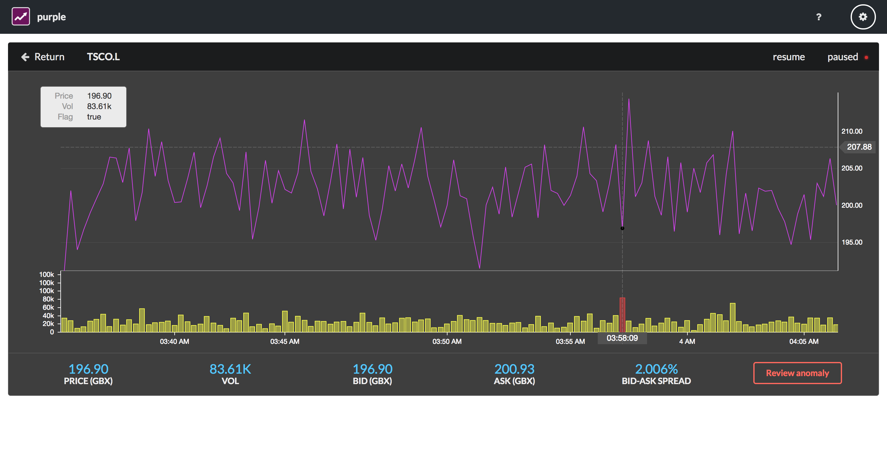

# README

Basically the project for CS261




## Installation instructions

I am not aware of how installation works on Microsoft machines,
but the steps are still in the same order (but are not done the same).

### Step 1: Homebrew

Homebrew is the missing package manager for mac.
Just get it by typing this into a terminal.

    /usr/bin/ruby -e "$(curl -fsSL https://raw.githubusercontent.com/Homebrew/install/master/install)"


### Step 2: Install Python and deps

Type in your terminal, it will install Python, pip and setuptools:

    brew install python

Now you need to install `virtualenv` (to create virtual environments)

    sudo pip install virtualenv

### Step 3: Rethinkdb

It will install the main binary for our database

    brew install rethinkdb


### Step 4: NodeJS

While our backend is in Python, our frontend runs on a light
`node` app called `expressjs` coupled with a real-time framework
called `horizon`.

    brew install node

You should now be able to have the `npm` command available to you.

## Build: Setting it all up

Go to the project's root (cs261/) and type one after the other:

### Python environment and python dependencies

    virtualenv env
    source env/bin/activate
    pip install --upgrade pip
    pip install -r requirements.txt

You should now launch rethinkdb in the background by running:

    rethinkdb &

That will launch rethinkdb in the background and will setup the
database. Don't worry if it tells you it needs some input.

### [Database setup](docs/Database.md)

Setup the database [here](docs/Database.md)

### JavaScript bundle and dependencies

    cd frontend/
    npm install --save


### Running the Frontend

Now you can
- Run the server
- Compile the javascript

But you have to do that in two different terminal windows (or tabs). So open up another tab and go to the same directory (cs261/frontend).

Compile the code and watch for changes with:

    npm run build

Don't worry if you see a bunch of errors, they are linting errors
and not syntax.

On the other tab you can start the server with

    node server.js

I guess you can now go and visit `http://127.0.0.1:8181/`


### Running the Backend

The file which handles what you want to do when running the backend is main.py.

The first time you run the backend, you will want to initialise the db, which is done by running:

    python main.py --init-db

(You only need to do this once)

Then, if you would like to analyse the live feed as it comes in, run the following:

    python main.py -s cs261.dcs.warwick.ac.uk

If you want to analyse a CSV file, run the following:

    python main.py -f /path/to/file

Where /path/to/file is the path to the CSV you want to analyse.


### General Workflow

1. Make sure PostgreSQL and rethinkdb are running. PostgreSQL is run through the Mac App, and rethink can be run using:

    ```bash
    rethinkdb &
    ```

2. Go to your cloned version of the Git repo, and update to the latest version by running:

    ```bash
    git pull
    ```

3. Enter your python virtualenv (the thing that handles all our dependencies) with:

    ```bash
    source env/bin/activate
    ```

4. Check to see if any backend dependencies have changed, by running the following:

    ```bash
    pip install -r requirements.txt
    ```

5. Check to see if any frontend dependenceis have changed, by running the following from the frontend folder:

    ```bash
    npm install --save
    ```

6. When you're done, exit the virtualenv by running:

    ```bash
    deactivate
    ```

Good hacking!
